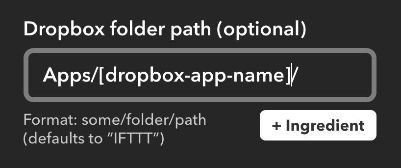
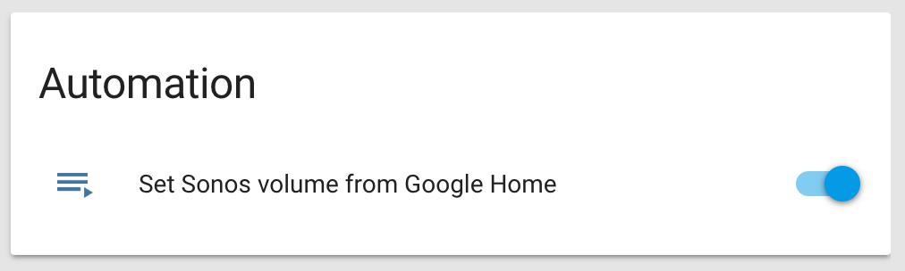

SoCoGa // Sonos Controller for Google Home
====

SoCoGa (Sonos Controller + Google Assistant) is a Python script that to allows you to
 control [Sonos speakers](http://www.sonos.com/en-us/home) with basic voice commands from your [Google Home](https://madeby.google.com/home). It is based on the open source [SoCo project](https://github.com/SoCo/SoCo) and works in conjunction with [Google Assistant (Google Home)](https://assistant.google.com/), [IFTTT](https://ifttt.com/), and [Dropbox](https://www.dropbox.com/developers).


IFTTT applets
------------

Current working applets (Note: the word "set" is a GA override so alternative verbs must be used):
- [Volume: "turn Sonos volume to #"](http://imgur.com/vbWUv7z)
    - File name syntax: "volume.#.txt"

Future:
- Toggle speech enhancement
- Toggle night Mode


Installation
------------

SoCoGa requires a Python script to run continuously on the same local network as the Sonos you would like to control. I recommend using a [Home Assistant](https://home-assistant.io/) automation running on an ethernet connected Raspberry Pi, but theoretically this will work on any device that can run Python.

This process takes about 20 minutes so buckle up!

### Setup Dropbox

First you will need to create a personal dropbox app by signing up at https://www.dropbox.com/developers/apps/. Sign up using the following steps:
1. Click "Create app"
2. Select "Dropbox Api"
3. Select "App Folder"
4. Enter a name your personal app - the name doesn't matter but will be used as the **[dropbox-app-name]** variable in the IFTTT applet.


Next, generate a personal token by following the instructions [here](https://blogs.dropbox.com/developers/2014/05/generate-an-access-token-for-your-own-account/) which you will need to paste in for the **[dropbox-token]** in config.txt (covered shortly).

### Setup IFTTT

Now add one of the applets listed [above](http://imgur.com/vbWUv7z) to your IFTTT account. Once you have connected your dropbox account, edit the applet so that the file path matches your **[dropbox-app-name]**. E.g. "Apps/SoCoGa"



### Setup the Python Script

Once your apps are setup, its time to setup your device that will run the script.

 On your unix device, install [SoCo](https://github.com/SoCo/SoCo):

``pip install soco``

``pip install requests``

Install dropbox on the device (you may need to reboot after this point):

``pip install dropbox``

Finally, setup the socoga.py script:

Using your preferred method, the socoga.py script should run continuously at a set interval on your device, I've found 3 second intervals works just fine.

Create your config file from he template (or just hard-code your token into the script):

``cp config.txt.example config.txt``

``sudo nano config.txt``

Replace **[dropbox-token]** with your generated dropbox token you created above.
```
[socoga config]
dropbox-token = [dropbox-token]
platform = sonos
```
Confirm that your `configFilePath` in socoga.py is pointing to the absolute location for config.txt as well.

``configFilePath = '/home/homeassistant/.homeassistant/SoCoGa/config.txt'``

At this point, if you chose to use [Home Assistant](https://home-assistant.io), you can can setup an automation by following the [install instructions here](https://home-assistant.io/getting-started/), then cloning this repo into the main /.homeassisant/ directory, and lastly adding the following automation to your configuration.yaml file:

```
shell_command:
  alias: "socoga script"
  socoga: "python /home/homeassistant/.homeassistant/SoCoGa/socoga.py"

automation:
  alias: "Control Sonos with Google Home"
  initial_state: True
  hide_entity: False
  trigger:
    platform: time
    seconds: /3
  action:
    service: shell_command.socoga
```

If everything worked correctly your Home Assistant interface should look like this:



Congratulations, you should now have the script up and running on your local network. Try saying "Hey Google, turn the Sonos volume to 50" to test it out.


Contributing
------------

This project was put together after about a day of hacking, if there is a feature you would like, something you think might be more efficient, or even if you just have an edit for this readme - pull requests are very welcomed.


License
-------

SoCoGa is released under the [MIT license](http://www.opensource.org/licenses/mit-license.php).

SoCoGa includes code from [SoCo](https://github.com/SoCo/SoCo), which is licensed under the [MIT license](http://www.opensource.org/licenses/mit-license.php).
